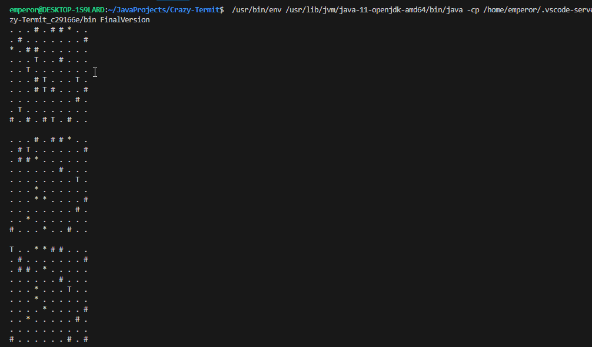

# Description of the task 
This project implements a simple simulation of termite collective behavior on a two-dimensional grid. Inspired by real-life examples of emergent order in animal species, the simulation models how a group of termites, following very basic rules and without any intelligence, can collectively organize scattered wood chips in a structured way.

# Project Overview
In the animal world, large groups of creatures can construct seemingly planned structures, such as beaver dams or termite mounds. This project explores how order can arise without explicit direction or intelligence by simulating the behavior of termites that follow a few simple rules while randomly wandering across a grid filled with randomly scattered wood chips.

# Simulation Details
The simulation is performed on a 200x200 2D grid with periodic boundary conditions.
Initially, wood chips are randomly scattered across the grid.
A few termites (agents) move randomly across the grid, following these rules:
Wander randomly until bumping into a wood chip.
If the termite carries a wood chip, it drops it and continues wandering.
If the termite does not carry a wood chip, it picks up the chip it bumped into and continues wandering.
Periodic boundary conditions allow the termites to "wrap around" the grid:
When a termite moves beyond the right edge (x = 199), it reappears on the left edge (x = 0).
Similarly, vertical motion wraps around the top and bottom boundaries of the grid.
Key Features
Emergent Behavior: Observe how random actions by simple agents (termites) can lead to patterns or organized structures over time.
Customizable Grid and Agents: Modify grid size, termite count, and the number of wood chips.
Visualization: Visualize the simulation steps to see the evolving structure of the scattered wood chips.

# Java version  
Folder **Code** contains Java file for terminal version of the game. 

# Processing version 

Folder **visual** contains file Processing, you have to have Processing software installed. 
https://www.youtube.com/watch?v=k-xL7BQZ97o

